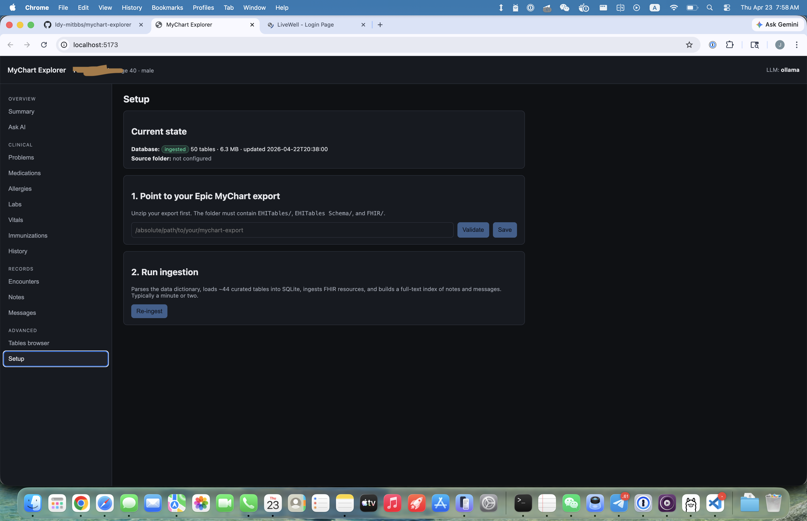
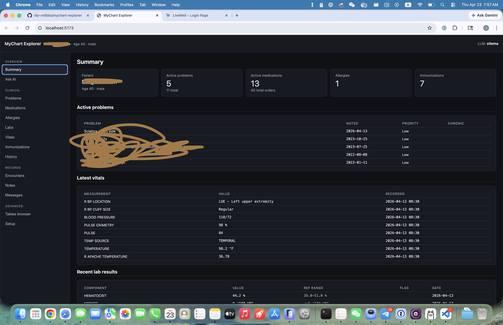
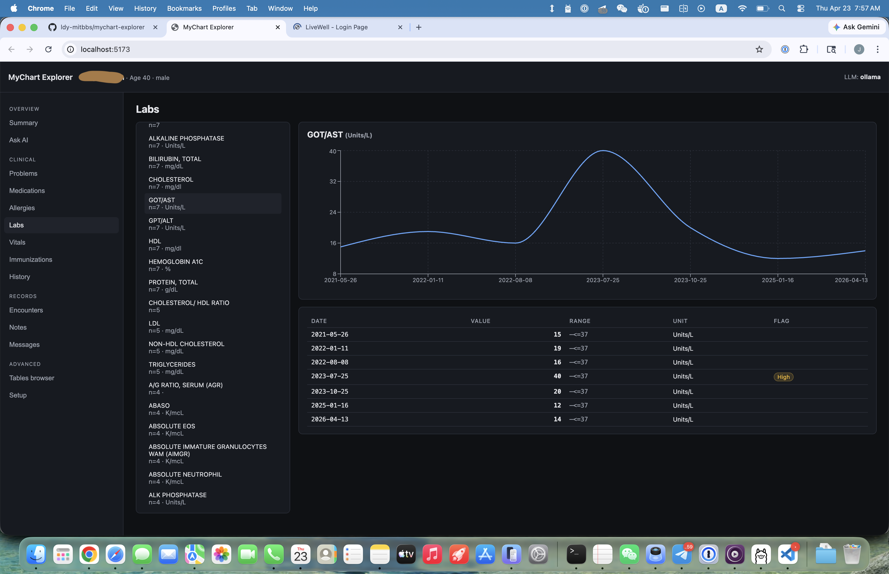

# MyChart Explorer

A **local, private** web app to browse your Epic MyChart (EHI) export and ask
an LLM questions about your health data. Default LLM backend is a local
[Ollama](https://ollama.com) model, so your records never leave your machine
unless you explicitly opt in to a cloud provider.

> ⚠️ **This is not a medical device.** It is a personal data-exploration tool.
> Do not rely on it for clinical decisions.

## Features

- **No-CLI setup**: point at your export folder from the in-app **Setup**
  page and click *Start ingest*. Progress streams live.
- **Curated dashboard**: summary, problems, medications, allergies, labs
  (with trend charts + reference ranges), vitals, immunizations, history,
  encounters with full detail, clinical notes with FTS5 search, MyChart
  messages (RTF → text), all flattened FHIR resources.
- **Generic table browser**: every table in your Epic export (~3,700 tables)
  — ingested ones via SQLite, the rest streamed from TSV on demand — with
  column descriptions from the Epic data dictionary as hover tooltips.
- **Read-only SQL console**: SELECT-only, auto-LIMITed, parse-validated with
  `sqlglot`.
- **AI chat** with tool-calling: the model can call
  `get_patient_summary`, `list_tables`, `describe_table`, `run_sql`,
  `search_notes`, `get_note`, `get_message`, and `lab_trend`. Responses cite
  sources like `[note:123]`, `[msg:456]`, `[table:PROBLEMS code=...]`.
- **Pluggable LLM**: Ollama (default, local), OpenAI, or Anthropic. Cloud
  providers show a red *"PHI sent to …"* banner while active.

## Screenshots

Screenshots live in `docs/screenshots/`. Drop PNGs there to populate:

- 
- 
- 
- 

## Architecture

```
mychart-explorer/
  ingest/       Parse schema HTM + load TSV + load FHIR NDJSON -> SQLite
                Reassemble notes + MyChart messages + FTS5 indexes
  backend/      FastAPI (localhost-only) + SQL guard + LLM router + tools
                Admin routes for UI-driven ingestion
  frontend/     React + Vite + TypeScript + recharts
  data/         mychart.db, schema.json, settings.json (generated, gitignored)
```

## Prerequisites

- **Python** 3.11+
- **Node.js** 18+
- **Your Epic MyChart export** — request it from your patient portal. Unzip
  it somewhere convenient; the folder should contain `EHITables/` (TSVs),
  `EHITables Schema/` (HTML data dictionary), and `FHIR/` (NDJSON bundles).
- **Optional: [Ollama](https://ollama.com)** for local LLM chat.

## Quick start

```sh
git clone https://github.com/ldy-mitbbs/mychart-explorer.git
cd mychart-explorer

# 1. Python env + deps
python3 -m venv .venv
source .venv/bin/activate
pip install -r requirements.txt

# 2. Start the backend (in one terminal)
uvicorn backend.main:app --host 127.0.0.1 --port 8765

# 3. Start the frontend (in another terminal)
cd frontend
npm install
npm run dev
# open http://localhost:5173
```

On first launch the app will route you to the **Setup** page. Paste the
absolute path to your Epic export, click *Validate*, then *Save*, then
*Start ingest*. Progress streams to the UI.

### CLI alternative

Prefer scripting? The same pipeline is exposed as a CLI:

```sh
python -m ingest --source "/path/to/your/Epic Export" --db data/mychart.db
```

## LLM setup

### Local (recommended)

```sh
brew install ollama           # or see ollama.com for your platform
ollama serve &
ollama pull qwen3.6           # or llama3.1:8b for less RAM
```

In the app's **Ask AI** tab → *Settings*, set the model name to whatever
`ollama list` shows.

### Cloud (opt-in)

Set the key **before** starting the backend:

```sh
export OPENAI_API_KEY=sk-...      # or
export ANTHROPIC_API_KEY=sk-ant-...
uvicorn backend.main:app --host 127.0.0.1 --port 8765
```

Then pick the provider in the chat settings drawer. A banner will flag that
cloud calls are active. **Your PHI will be transmitted to that provider** for
each turn, so only enable this if you're comfortable with their data policy.

## Privacy & security

- Backend binds to `127.0.0.1` only. Nothing listens on your LAN.
- SQLite is opened read-only at runtime.
- The `/api/sql` endpoint parses every query with `sqlglot`, rejects anything
  that isn't a `SELECT`/`WITH`, and auto-injects a row limit.
- `data/` (containing your ingested DB and settings) is gitignored.
- The app ships no telemetry.

## Env vars

All env vars are optional — you can configure the app from the Setup page instead.

| Name | Default | Purpose |
|---|---|---|
| `MYCHART_SOURCE` | — | Override source folder (else use Setup page) |
| `MYCHART_DB` | `data/mychart.db` | Output SQLite path |
| `MYCHART_SCHEMA_JSON` | `data/schema.json` | Parsed data-dictionary path |
| `OPENAI_API_KEY` | — | Enables OpenAI provider |
| `ANTHROPIC_API_KEY` | — | Enables Anthropic provider |

## Ingest flags

```sh
python -m ingest --source ... --db ... [--skip-schema] [--skip-tsv] [--skip-fhir] [--skip-notes]
```

Each phase is idempotent and independent, so it's safe to re-run after
editing the curated-tables list in `ingest/tables.py`.

## Adding more tables

By default ~40 clinical tables are loaded into SQLite for fast access. Any
other table from your export is still reachable on demand via the **Tables
browser** (streamed from TSV). To promote a table to SQLite:

1. Add its name (and optional index columns) to `ingest/tables.py`.
2. Re-run the ingest (Setup page → *Re-ingest*, or the CLI with
   `--skip-schema --skip-fhir`).

## Disclaimer

This project is not affiliated with Epic Systems, any health system, or any
electronic-health-record vendor. Use at your own risk. The authors are not
clinicians and this is not medical advice.

## License

[MIT](LICENSE)
