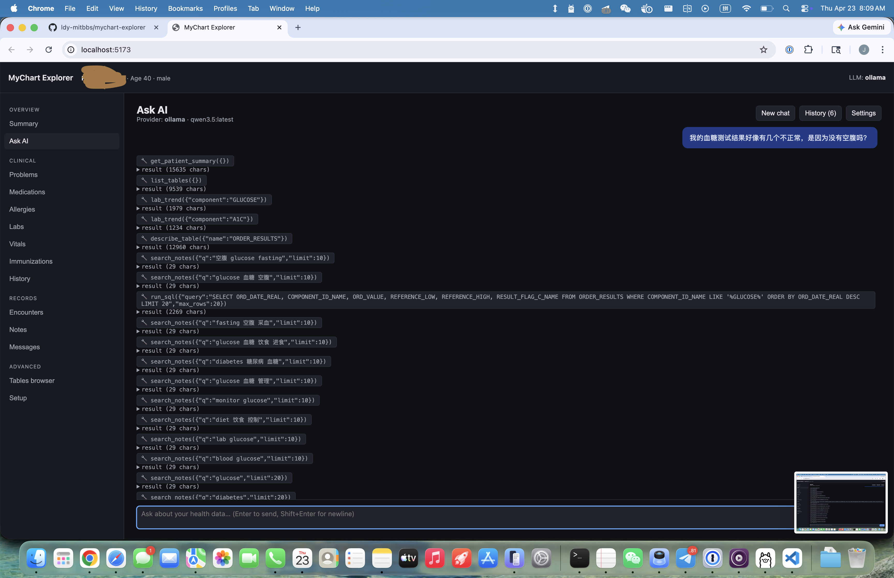
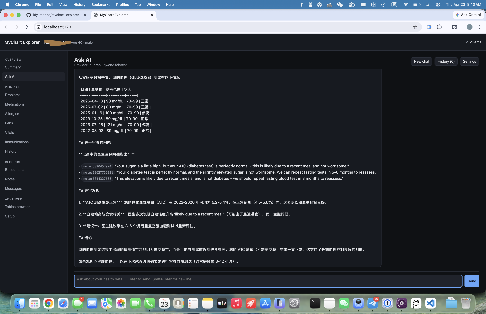
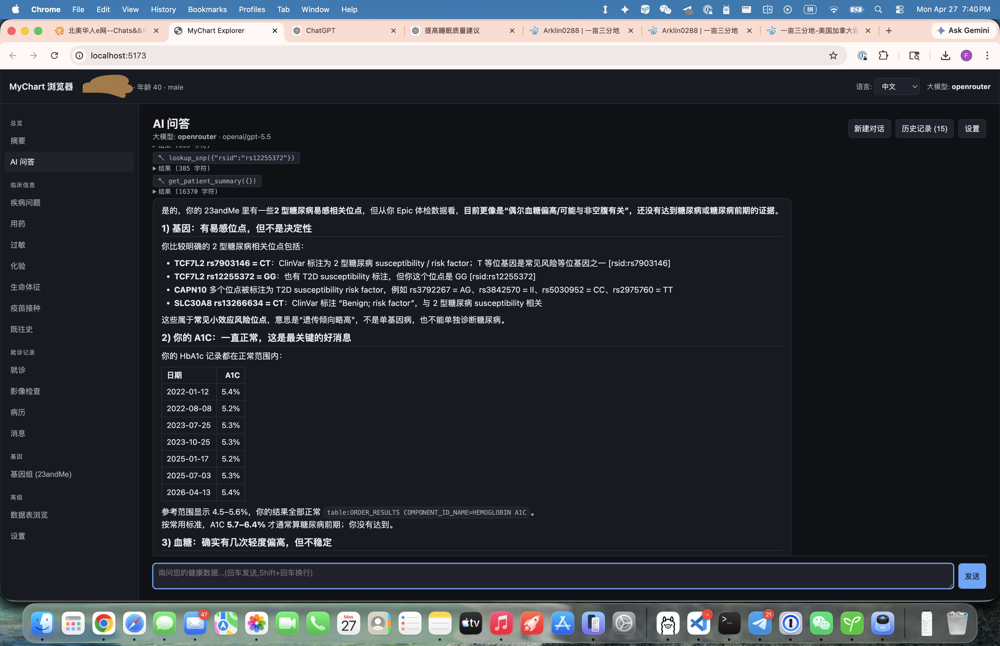
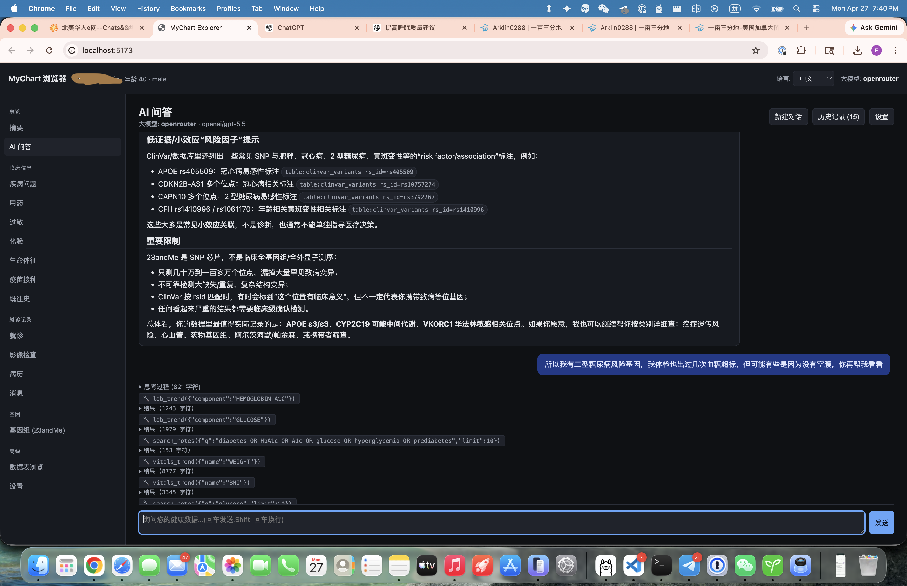

# MyChart Explorer（中文版）

> English version: [README.en.md](README.en.md)

这是一个**本地运行、注重隐私**的 Web 应用，适合用来浏览你从 Epic MyChart 导出的电子健康信息（EHI），并借助大语言模型（LLM）查询和理解自己的健康数据。默认的 LLM backend 是本地部署的 [Ollama](https://ollama.com) 模型，因此除非你主动启用 cloud provider，否则你的病历数据不会离开本机。

> ⚠️ **本项目不是 medical device。** 它只是一个个人数据探索工具，请勿用于临床决策。

## Features

- **无需命令行即可完成配置**：在应用内的 **Setup page** 中选择你的导出目录，然后点击 *Start ingest*，即可实时查看 ingest progress。
- **精选 dashboard**：提供 summary、problems、medications、allergies、labs（含 trend chart 和 reference range）、vitals、immunizations、history、encounters 完整详情、支持 FTS5 full-text search 的 clinical notes、MyChart messages（RTF 转纯文本），以及所有扁平化后的 FHIR resources。
- **Tables browser**：可查看 Epic 导出中的全部表（约 3700 张）。已 ingest 的表通过 SQLite 访问，其余表则按需从 TSV 流式读取；每一列的说明来自 Epic data dictionary，并以 hover tooltip 的形式展示。
- **可选的 23andMe 基因数据**：把 23andMe raw data 文件夹（`genome_*.txt`，可选附带 ancestry composition CSV）也指给应用，它会把约 140 万个 SNP 基因型加载进 SQLite，并自动下载并缓存 NCBI **ClinVar**（约 440 MB，GRCh37）做注释关联。这样你就可以在专门的 **Genome (23andMe)** 标签页和 chat 里浏览致病变异、影响药物反应的位点，按 rsid 或基因查询，并查看 ancestry breakdown。
- **read-only SQL console**：仅允许执行 SELECT，自动附加 LIMIT，并使用 `sqlglot` 做语法校验。
- **AI chat（支持 tool calling）**：模型可以调用
  `get_patient_summary`、`list_tables`、`describe_table`、`run_sql`、
  `search_notes`、`get_note`、`get_message`、`lab_trend`，以及基因相关的
  `lookup_snp`、`list_notable_variants`、`search_variants_by_gene`、
  `get_ancestry_summary`。回答会附带 source citation，例如
  `[note:123]`、`[msg:456]`、`[table:PROBLEMS code=...]`、`[rsid:rs429358]`。
- **Pluggable LLM**：支持 Ollama（默认,本地）、OpenAI 和 Anthropic。启用 cloud provider 时,界面上会显示红色的 *"PHI sent to …"(个人健康信息已发送至…)* warning banner。
- **中英双语界面（English / 简体中文）**：顶部导航栏可切换语言,偏好会保存在 localStorage 中,首次访问时会根据浏览器语言自动判断(`zh-*` 浏览器默认中文)。非常适合把这个应用分享给英文阅读不便的家人长辈——用中文提问,本地 LLM 也会用中文作答。

## Screenshots











## Architecture

```
mychart-explorer/
  ingest/       解析 schema HTM + ingest TSV + ingest FHIR NDJSON -> SQLite
                重组笔记 + MyChart messages + 建立 FTS5 index
  backend/      FastAPI（仅监听 localhost）+ SQL guard + LLM router + tools
                提供由 UI 驱动的 ingest admin routes
  frontend/     React + Vite + TypeScript + recharts
  data/         mychart.db, schema.json, settings.json（自动生成，且已加入 gitignore）
```

## Prerequisites

- **Python** 3.11+（后端使用 PEP 604 的 `X | None` 联合类型语法，至少需要 3.10，推荐 3.11+）。macOS 自带的 `python3` 仍然是 3.9，请先用 `python3 --version` 确认版本。如需安装新版本：
  - **macOS**（Homebrew）：`brew install python@3.12`，随后使用 `python3.12`。
  - **Ubuntu/Debian**：`sudo apt install python3.12 python3.12-venv`。
  - **Windows**：从 [python.org](https://www.python.org/downloads/) 下载安装，使用 `py -3.12`。
- **Node.js** 18+
- **你的 Epic MyChart 导出数据**：可通过 patient portal 申请。解压到一个方便的位置后，目录中应包含 `EHITables/`（TSV 文件）、`EHITables Schema/`（HTML 数据字典）和 `FHIR/`（NDJSON 文件）。
- **可选：[Ollama](https://ollama.com)**，用于本地 LLM 聊天。

## Quick start

```sh
git clone https://github.com/ldy-mitbbs/mychart-explorer.git
cd mychart-explorer

# 1. Python 虚拟环境与依赖 —— 请确保解释器版本 >= 3.11。
#    如果你安装的是别的版本，把 `python3.12` 换成对应的可执行文件。
python3.12 -m venv .venv
source .venv/bin/activate
python -V   # 应当显示 3.11 或更高
pip install -r requirements.txt

# 2. 启动后端（一个终端）
uvicorn backend.main:app --host 127.0.0.1 --port 8765

# 3. 启动前端（另一个终端）
cd frontend
npm install
npm run dev
# 浏览器打开 http://localhost:5173
```

### 一键启动（可选）

两种方式可以避免每次都开两个终端：

- **VS Code 用户**：直接按 `Cmd+Shift+B`（或 *Tasks: Run Task → Dev: backend + frontend*），仓库内的 [.vscode/tasks.json](.vscode/tasks.json) 会同时启动 backend 与 frontend，每个进程一个独立的终端面板。
- **命令行用户**：在仓库根目录运行 `./dev.sh`，脚本会自动激活 `.venv`、按需 `npm install`，并把两个进程并排跑起来；按一次 `Ctrl+C` 即可同时关闭。

首次启动时，应用会自动跳转到 **Setup page**。将 Epic 导出目录的绝对路径粘贴进去，依次点击 *Validate*、*Save* 和 *Start ingest*，随后就可以在界面中实时看到 ingest progress。

### CLI alternative

如果你更习惯脚本化操作，也可以使用同一套导入流程对应的命令行接口：

```sh
python -m ingest --source "/path/to/your/Epic Export" --db data/mychart.db
```

## LLM setup

### Local（推荐）

```sh
brew install ollama           # 或参考 ollama.com 上你所用平台的安装说明
ollama serve &
ollama pull qwen3.5           # 默认模型；替代选项见下方的内存建议表
```

在应用的 **Ask AI（向 AI 提问）** 标签页里，打开 *Settings（设置）*，然后从下拉菜单中选择一个模型（列表由 `ollama list` 自动填充）。聊天功能会通过 tool calls 查询你的 SQLite 数据库，因此**请优先选择在 [ollama.com/library](https://ollama.com/library) 上带有 `tools` 标签的模型**。

#### 按内存选模型

在默认的 Q4 量化下，显存或统一内存的大致预算可按 `参数量 × 0.6 GB` 估算，另外还需要额外预留几 GB 给上下文。如果你只使用 CPU，同样的数字也可大致对应系统内存，只是生成速度会更慢。

| 你的内存     | 推荐的支持工具调用的模型（Ollama tag）                                  |
| ----------- | --------------------------------------------------------------------- |
| 4–6 GB      | `qwen3:1.7b`, `qwen2.5:1.5b`, `granite4:1b`, `granite4:3b`            |
| 8 GB        | `qwen3:4b`, `qwen2.5:3b`, `phi4-mini:3.8b`, `granite3.3:2b`           |
| 12–16 GB    | `qwen3:8b` *（sweet spot）*, `qwen2.5:7b`, `qwen3.5:9b`, `granite3.3:8b`   |
| 24–32 GB    | `qwen3:14b`, `phi4:14b`, `qwen3.5:27b`（较吃紧）, `mistral-small:24b`, `qwen3.6:27b` † |
| 48–64 GB    | `qwen3:30b`（MoE，速度快）, `gpt-oss:20b`, `qwen3:32b`, `qwen3.5:35b`, `qwen3.6:35b` † |
| 96 GB+      | `qwen3:235b`（MoE）, `gpt-oss:120b`, `qwen3.5:122b`                   |

说明：

- **Qwen 3 / 3.5**（阿里巴巴）是目前很主流的开源模型家族，工具调用能力强，覆盖从 0.6B 到 235B MoE 的多种规模。
- **Qwen3 30B MoE** 每个 token 实际只激活约 3B 参数，因此运行速度接近 7B 模型，但推理能力更接近大模型；如果你的内存足够容纳权重，它会是很有性价比的选择。
- **Phi-4-mini / Phi-4**（微软）在相同参数量下推理能力非常出色。
- **Granite 4** / **Granite 3.3**（IBM）体积小、速度快，并针对工具调用做了调优，很适合 8 GB 内存的笔记本。
- **gpt-oss**（OpenAI 开放权重）和 **Mistral Small 3** 也是中大规模里不错的选择。这个应用不建议使用基础版 **Gemma 3**，因为它不支持工具调用；如果你想用 Google 的模型，请选择 **Gemma 4**。
- 如果某个模型在工具调用时表现不稳定，可以先降一个参数档位，或者直接换成 `qwen3` 系列。

† **qwen3.6** 是 2026 年 4 月刚发布的新模型，目前只有 27B/35B 两个尺寸。它属于 `thinking` 类型，在代码 Agent 场景下成绩很强；不过新模型发布初期的工具调用模板往往还不够稳定，如果你遇到格式错误，建议先回退到 `qwen3:32b` 或 `qwen3.5:27b`。

### Cloud（需主动开启）

请在启动后端**之前**设置 API Key：

```sh
export OPENAI_API_KEY=sk-...      # 或
export ANTHROPIC_API_KEY=sk-ant-...
uvicorn backend.main:app --host 127.0.0.1 --port 8765
```

然后在 chat settings panel 中选择对应的 provider。界面会显示 warning banner，提示当前正在使用云端服务。**每轮对话都会将你的 PHI（受保护健康信息）发送给该 provider**，因此只有在你确认能够接受对方的数据政策后，才建议启用。

## Privacy & security

- 后端仅绑定到 `127.0.0.1`，不会在局域网上监听。
- 运行时以只读方式打开 SQLite。
- `/api/sql` 端点会使用 `sqlglot` 解析每条查询，拒绝所有非 `SELECT` / `WITH` 的语句，并自动附加行数限制。
- `data/`（包含导入后的数据库和设置）已加入 gitignore。
- 应用不发送任何遥测数据。

## Environment variables

所有环境变量都是可选的，你也可以直接在 Setup 页面里完成配置。

| 名称 | 默认值 | 用途 |
|---|---|---|
| `MYCHART_SOURCE` | — | 覆盖源目录（否则使用 Setup 页面的设置） |
| `MYCHART_DB` | `data/mychart.db` | 输出的 SQLite 路径 |
| `MYCHART_SCHEMA_JSON` | `data/schema.json` | 解析后的 data dictionary 路径 |
| `MYCHART_GENOME` | — | 覆盖 23andMe 导出目录/文件（否则使用 Setup 页面的设置） |
| `OPENAI_API_KEY` | — | 启用 OpenAI provider |
| `ANTHROPIC_API_KEY` | — | 启用 Anthropic provider |

## Ingest flags

```sh
python -m ingest --source ... --db ... \
  [--skip-schema] [--skip-tsv] [--skip-fhir] [--skip-notes] \
  [--genome-source PATH] [--skip-genome] [--skip-clinvar]
```

每个阶段都是幂等且彼此独立的，因此即使你修改了 `ingest/tables.py` 中的精选表列表，或者把新的 23andMe 导出放进了基因目录，都可以放心重新运行。

## 23andMe 基因数据（可选）


Epic 导出的是你的临床病历；基因层补上 DNA。两者会合并写入同一个 `data/mychart.db`，所以 AI 在同一段对话里既能看化验和病历笔记，也能看变异位点。

**你需要准备什么。** 在 [you.23andme.com → Browse Raw Data → Download](https://you.23andme.com/tools/data/download/) 中下载 **raw data**（即形如 `genome_<姓名>_v3_v5_Full_<时间戳>.txt` 的文件）。ancestry composition CSV 不是必需的，但提供后会驱动 *Ancestry* 标签页。

**配置方式。** 进入 **Setup** 页面，在 *3. (Optional) 23andMe genome export* 中填入 raw data 文件或其所在目录的绝对路径。点 *Validate*（应用会自动识别两个文件），再 *Save*，然后 *Start ingest*。基因层可以单独重新 ingest，无需重新跑 Epic 部分。

**关于 ClinVar。** 第一次运行时，ingester 会从 NCBI 下载 `variant_summary.txt.gz`（约 440 MB）到 `data/clinvar/`，过滤出 GRCh37 且带 rs# 的条目，加载约 290 万行注释。如果你希望完全离线运行，可以勾选 *Skip ClinVar download*——基因型数据照常入库，只是没有临床注释。

**命令行用法。**

```sh
# 首次基因 ingest（会下载 ClinVar）：
python -m ingest --genome-source "/path/to/23andMe-folder"

# 仅重新加载基因层，复用之前缓存的 ClinVar：
python -m ingest --genome-source "/path/to/23andMe-folder" \
  --skip-schema --skip-tsv --skip-fhir --skip-notes

# 完全跳过 ClinVar（仅入库原始基因型）：
python -m ingest --genome-source "/path/to/23andMe-folder" --skip-clinvar
```

**可以试着这样问 AI：**

- *“我的 APOE 基因型是什么？对阿尔茨海默病风险有什么影响？”*
- *“我携带 BRCA1 或 BRCA2 上的致病变异吗？”*
- *“查一下 rs1801133——我有 MTHFR 变异吗？”*
- *“看一下我的 ancestry composition。”*

**注意事项。** 23andMe 的 genotyping array 实际只读取约 60 万–140 万个 SNP，远不到 30 亿碱基的全基因组——它**漏掉绝大多数罕见变异**，**无法检测拷贝数变化**，**也不带相位信息**。ClinVar 的命中只是筛查级别的提示，不是诊断。系统 prompt 会提醒模型主动声明这些局限，但任何实际行动都请先咨询临床遗传学专业人员。

## Adding more tables

默认会将约 40 张 clinical tables 加载到 SQLite 中，以便快速访问。导出数据中的其他表仍然可以通过 **Tables browser** 按需访问（从 TSV 流式读取）。如果你想把某张表也纳入 SQLite：

1. 在 `ingest/tables.py` 中加入它的名字（以及可选的索引列）。
2. 重新运行 ingest（通过 Setup page 中的 *Re-ingest*，或在命令行中使用
   `--skip-schema --skip-fhir`）。

## Disclaimer

本项目与 Epic Systems、任何医疗机构以及任何 electronic health record 厂商均无关联。请自行承担使用风险。作者并非临床医生，本项目也不构成医学建议。

## License

[MIT](LICENSE)
